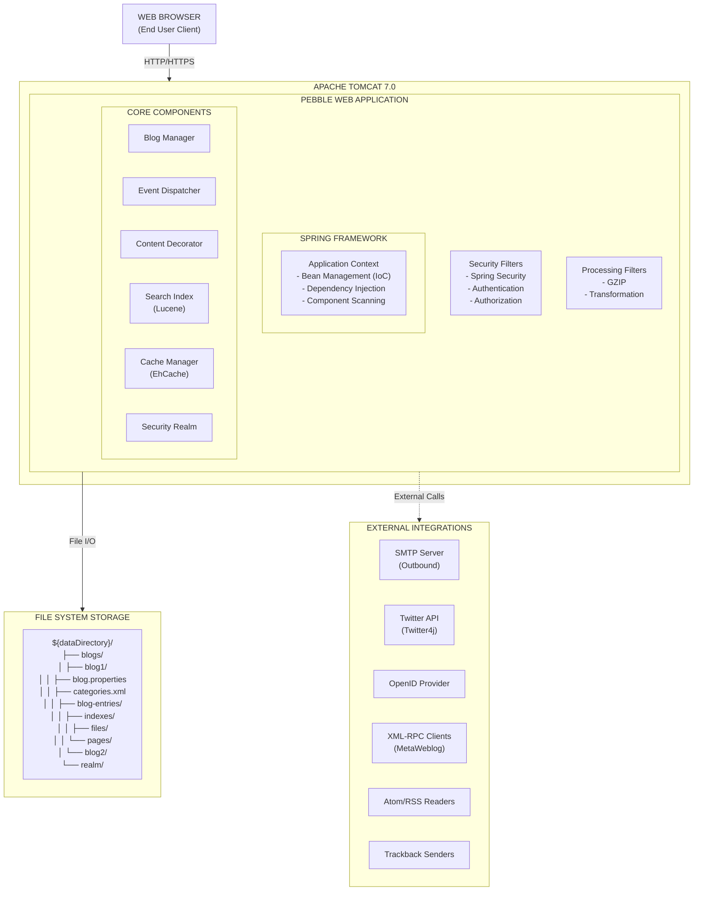
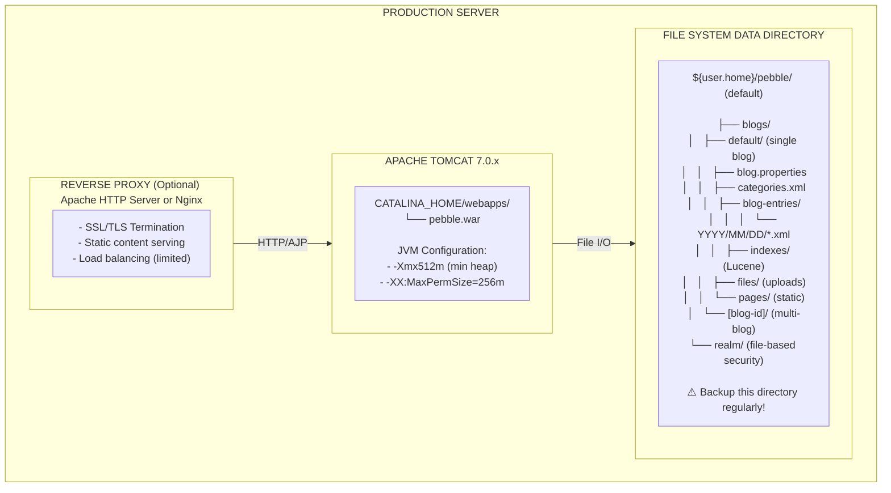
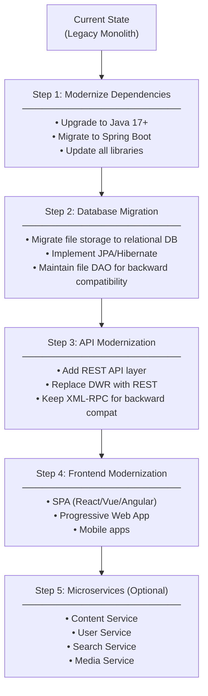

# Pebble Architecture Overview

## Executive Summary

Pebble is a lightweight, open-source Java EE blogging platform that follows a **layered monolithic architecture** with a file-based persistence model. Built on Spring Framework and deployed as a WAR file to servlet containers, it represents a classic Java web application architecture from the mid-2000s era.

**Status:** This project is no longer maintained and should not be used for new installations.

---

## 1. Architectural Pattern

### 1.1 Primary Pattern: Layered Monolithic Web Application

Pebble follows a traditional **layered monolithic architecture** with clear separation of concerns:

```mermaid
graph TB
    subgraph PresentationLayer["PRESENTATION LAYER"]
        JSP["JSP Pages"]
        Filters["Filters"]
        Servlets["Servlets"]
        Views["Views"]
    end

    subgraph WebControllerLayer["WEB CONTROLLER LAYER"]
        ActionFactory["Action Factory"]
        ActionController["Action Controller"]
        XMLRPCController["XML-RPC Controller"]
        DWR["DWR (AJAX)"]
    end

    subgraph BusinessLayer["BUSINESS LAYER"]
        Services["Services"]
        EventDispatchers["Event Dispatchers"]
        DecoratorChain["Decorator Chain"]
    end

    subgraph DomainLayer["DOMAIN LAYER"]
        Blog["Blog"]
        BlogEntry["BlogEntry"]
        Comment["Comment"]
        TrackBack["TrackBack"]
        Category["Category"]
        Tag["Tag"]
        StaticPage["Static Page"]
        User["User"]
    end

    subgraph DataAccessLayer["DATA ACCESS LAYER"]
        DAOFactory["DAO Factory"]
        DAOInterfaces["DAO Interfaces"]
        DAOImplementations["DAO Implementations"]
    end

    subgraph PersistenceLayer["PERSISTENCE LAYER"]
        FileSystem["FILE SYSTEM<br/>(XML/Properties)"]
    end

    PresentationLayer --> WebControllerLayer
    WebControllerLayer --> BusinessLayer
    BusinessLayer --> DomainLayer
    DomainLayer --> DataAccessLayer
    DataAccessLayer --> PersistenceLayer
```



### 1.2 Supporting Patterns

- **MVC (Model-View-Controller)**: Clear separation between domain models, JSP views, and controller servlets
- **Front Controller**: Servlet filters and action controllers handle all incoming requests
- **Dependency Injection**: Spring IoC container manages component lifecycle
- **Decorator Pattern**: Content and page decorators for extensibility
- **Event-Driven**: Observer pattern for blog events (comment added, entry published, etc.)
- **Plugin Architecture**: Extensible through decorator, listener, and strategy interfaces
- **Repository Pattern**: DAO abstraction for data access

---

## 2. Component Architecture

### 2.1 High-Level Component Diagram



### 2.2 Core Components

#### 2.2.1 Web Layer Components

| Component | Location | Responsibility |
|-----------|----------|----------------|
| **Filters** | `net.sourceforge.pebble.web.filter` | Request pre-processing, security, GZIP, transformations |
| **Servlets** | `net.sourceforge.pebble.web.controller` | HTTP request routing and handling |
| **Actions** | `net.sourceforge.pebble.web.action` | Business logic for specific user actions |
| **Views** | `src/main/webapp/WEB-INF/jsp` | JSP templates for rendering |
| **DWR (AJAX)** | `net.sourceforge.pebble.web.dwr` | Asynchronous JavaScript and XML support |
| **Tag Libraries** | `net.sourceforge.pebble.web.tagext` | Custom JSP tags |

#### 2.2.2 Domain Layer Components

| Component | Location | Responsibility |
|-----------|----------|----------------|
| **Blog** | `net.sourceforge.pebble.domain.Blog` | Central blog aggregate root |
| **BlogEntry** | `net.sourceforge.pebble.domain.BlogEntry` | Individual blog post |
| **Comment** | `net.sourceforge.pebble.domain.Comment` | User comments on blog entries |
| **TrackBack** | `net.sourceforge.pebble.domain.TrackBack` | Trackback/pingback support |
| **Category** | `net.sourceforge.pebble.domain.Category` | Blog entry categorization |
| **Tag** | `net.sourceforge.pebble.domain.Tag` | Folksonomy tagging |
| **StaticPage** | `net.sourceforge.pebble.domain.StaticPage` | Static content pages |
| **User** | `net.sourceforge.pebble.security` | User accounts and roles |

#### 2.2.3 Service Layer Components

| Component | Location | Responsibility |
|-----------|----------|----------------|
| **BlogService** | `net.sourceforge.pebble.domain.BlogService` | Blog CRUD operations |
| **BlogManager** | `net.sourceforge.pebble.domain.BlogManager` | Multi-blog management |
| **FileManager** | `net.sourceforge.pebble.domain.FileManager` | File upload/download |
| **LastModifiedService** | `net.sourceforge.pebble.service` | HTTP caching support |

#### 2.2.4 Data Access Layer Components

| Component | Location | Responsibility |
|-----------|----------|----------------|
| **DAOFactory** | `net.sourceforge.pebble.dao.DAOFactory` | DAO creation |
| **BlogEntryDAO** | `net.sourceforge.pebble.dao.file.FileBlogEntryDAO` | Blog entry persistence |
| **CategoryDAO** | `net.sourceforge.pebble.dao.file.FileCategoryDAO` | Category persistence |
| **StaticPageDAO** | `net.sourceforge.pebble.dao.file.FileStaticPageDAO` | Static page persistence |

#### 2.2.5 Cross-Cutting Components

| Component | Location | Responsibility |
|-----------|----------|----------------|
| **EventDispatcher** | `net.sourceforge.pebble.event` | Event-driven notifications |
| **ContentDecorator** | `net.sourceforge.pebble.decorator` | Content transformation pipeline |
| **SearchIndex** | `net.sourceforge.pebble.index` | Lucene-based full-text search |
| **ContentCache** | `net.sourceforge.pebble.ContentCache` | EhCache integration |
| **ConfirmationStrategy** | `net.sourceforge.pebble.confirmation` | CAPTCHA and spam prevention |
| **Logger** | `net.sourceforge.pebble.logging` | Access logging and analytics |

---

## 3. Technology Stack

### 3.1 Technology Stack Layers

```mermaid
graph TB
    subgraph ClientLayer["CLIENT LAYER"]
        HTMLCSS["HTML/CSS"]
        JavaScript["JavaScript"]
        FCKeditor["FCKeditor<br/>(WYSIWYG)"]
    end

    subgraph PresentationLayer["PRESENTATION LAYER"]
        JSP["JSP 2.2"]
        JSTL["JSTL"]
        CustomTagLibs["Custom Tag Libs"]
    end

    subgraph WebFrameworkLayer["WEB FRAMEWORK LAYER"]
        Servlet["Servlet 3.0"]
        Spring["Spring 3.0.7"]
        SpringSecurity["Spring Security 3.0.8"]
    end

    subgraph ApplicationLayer["APPLICATION LAYER"]
        PebbleDomain["Pebble Domain Models"]
        DWR["DWR 2.0-rc2"]
        ROME["ROME 1.5.1<br/>(RSS/Atom)"]
        XMLRPC["XML-RPC 1.2"]
        Twitter4j["Twitter4j 2.0.10"]
        JCaptcha["JCaptcha/ReCaptcha"]
    end

    subgraph InfrastructureLayer["INFRASTRUCTURE LAYER"]
        Lucene["Lucene 1.4.1<br/>(Search)"]
        EhCache["EhCache 2.10.5<br/>(Cache)"]
        JAXB["JAXB 2.0<br/>(XML)"]
        Commons["Commons Libraries"]
        JavaMail["JavaMail 1.4"]
        iText["iText 2.0.8<br/>(PDF)"]
    end

    subgraph RuntimeLayer["RUNTIME LAYER"]
        Java["Java 6.0 JVM"]
        Tomcat["Apache Tomcat 7.0.x"]
    end

    subgraph OSLayer["OPERATING SYSTEM LAYER"]
        OS["Linux / Windows / macOS"]
    end

    ClientLayer --> PresentationLayer
    PresentationLayer --> WebFrameworkLayer
    WebFrameworkLayer --> ApplicationLayer
    ApplicationLayer --> InfrastructureLayer
    InfrastructureLayer --> RuntimeLayer
    RuntimeLayer --> OSLayer
```



### 3.2 Key Dependencies

**Core Framework:**
- Spring Framework 3.0.7 (IoC, DI, Web support)
- Spring Security 3.0.8 (Authentication, Authorization, OpenID)

**Presentation:**
- JSP 2.2 / Servlet 3.0
- JSTL (JSP Standard Tag Library)
- FCKeditor (Rich text editor)

**Content & Feeds:**
- ROME 1.5.1 (RSS/Atom feed generation and parsing)
- ROME Propono 1.5.1 (Atom Publishing Protocol)
- JDOM 2.0.2 (XML processing)

**AJAX & Interactivity:**
- DWR 2.0-rc2 (Direct Web Remoting)

**Search & Indexing:**
- Lucene 1.4.1 (Full-text search)

**Caching:**
- EhCache 2.10.5 (In-memory caching)

**Spam Prevention:**
- JCaptcha 1.0-RC6 (Image CAPTCHA)
- ReCaptcha4j 0.0.7 (Google ReCaptcha)

**External Integration:**
- Twitter4j 2.0.10 (Twitter integration)
- XML-RPC 1.2 (Blogger/MetaWeblog API)
- JavaMail 1.4 (Email notifications)

**Utilities:**
- Apache Commons (Logging, Collections, Lang, FileUpload, HttpClient, IO)
- Google Guava r07
- iText 2.0.8 (PDF generation)
- Radeox 1.0-b2 (Wiki markup)
- JTidy (HTML cleanup)
- MaxMind GeoIP 1.2.10 (Geolocation)

**Testing:**
- JUnit 4.6
- Mockito 1.8.4

---

## 4. Deployment Architecture

### 4.1 Standard Deployment Model



### 4.2 Configuration Files

| File | Location | Purpose |
|------|----------|---------|
| `web.xml` | `/WEB-INF/web.xml` | Servlet deployment descriptor |
| `applicationContext-pebble.xml` | `/WEB-INF/applicationContext-pebble.xml` | Spring bean configuration |
| `applicationContext-security.xml` | `/WEB-INF/applicationContext-security.xml` | Spring Security config |
| `pebble.properties` | `/WEB-INF/pebble.properties` | Application configuration |
| `blog.properties` | `${dataDirectory}/blogs/[blog-id]/blog.properties` | Per-blog settings |
| `ehcache.xml` | `/WEB-INF/classes/ehcache.xml` | Cache configuration |

### 4.3 Deployment Modes

#### Single Blog Mode (Default)
```
- One Pebble instance = One blog
- Simpler configuration
- Data stored in ${dataDirectory}/blogs/default/
- URL: http://example.com/pebble/
```

#### Multi-Blog Mode
```
- One Pebble instance = Multiple blogs
- Enable via: multiBlog=true in pebble.properties
- Each blog has subdirectory: ${dataDirectory}/blogs/[blog-id]/
- URL patterns:
  - Path-based: http://example.com/pebble/blog1/
  - Subdomain-based: http://blog1.example.com/pebble/
```

#### Virtual Hosting Mode
```
- Multiple domains pointing to same Pebble instance
- Enable via: virtualHostingEnabled=true
- Blog selected by hostname
- Example:
  - blog1.com → blog1
  - blog2.com → blog2
```

---

## 5. Scalability and Performance Characteristics

### 5.1 Scalability Analysis

#### Current Limitations

| Aspect | Limitation | Impact |
|--------|------------|--------|
| **Persistence** | File-based storage (no database) | ⚠️ **Critical** - Not horizontally scalable |
| **Session State** | In-memory HTTP sessions | ⚠️ **High** - Cannot load balance across multiple instances |
| **File Locking** | No distributed file locking | ⚠️ **Critical** - Concurrent writes can corrupt data |
| **Search Index** | Local Lucene indexes | ⚠️ **High** - Cannot share index across instances |
| **Cache** | Local EhCache (no distributed cache) | ⚠️ **Medium** - Cache not shared across instances |
| **Static Files** | Stored in local filesystem | ⚠️ **Medium** - Requires shared storage for clustering |

#### Scalability Rating

| Metric | Rating | Score |
|--------|--------|-------|
| **Vertical Scalability** | ⬛⬛⬛⬛⬛⬛⬛⬛⬜⬜ | 8/10 |
| **Horizontal Scalability** | ⬛⬛⬜⬜⬜⬜⬜⬜⬜⬜ | 2/10 |
| **Multi-Tenancy** | ⬛⬛⬛⬛⬛⬛⬛⬛⬜⬜ | 8/10 |
| **Geographic Distribution** | ⬛⬜⬜⬜⬜⬜⬜⬜⬜⬜ | 1/10 |

**Recommendation:** Pebble is designed for single-server, small-to-medium traffic blogs. For high-traffic or mission-critical applications, consider database-backed alternatives.

### 5.2 Performance Characteristics

#### Strengths

1. **Caching Strategy:**
   - EhCache reduces database/file I/O
   - HTTP caching headers (Last-Modified, ETag)
   - Content decorator results cached
   - Feed caching

2. **Static Content:**
   - GZIP compression for HTML/CSS/JS
   - Efficient static file serving
   - Browser caching enabled

3. **Lazy Loading:**
   - Blog entries loaded on demand
   - Pagination for large result sets

4. **Indexing:**
   - Lucene provides fast full-text search
   - Incremental index updates
   - Multiple indexes (author, category, tag, response)

#### Weaknesses

1. **File I/O Overhead:**
   - XML parsing for each blog entry read
   - No connection pooling (file handles)
   - Sequential file scans for date ranges

2. **In-Memory Limitations:**
   - Large blogs can exhaust heap memory
   - No streaming for large files
   - Index rebuilds can be memory-intensive

3. **Synchronous Processing:**
   - Email notifications block request thread
   - Twitter updates are synchronous
   - Index updates during request processing

### 5.3 Performance Tuning Recommendations

#### 1. JVM Tuning
```bash
-Xms512m -Xmx1024m
-XX:MaxPermSize=256m
-XX:+UseConcMarkSweepGC
-XX:+CMSParallelRemarkEnabled
```

#### 2. EhCache Configuration
- Increase cache sizes for popular content
- Configure disk overflow for large caches
- Set appropriate TTL values

#### 3. Lucene Optimization
- Schedule index rebuilds during off-hours
- Use RAM directory for small indexes
- Optimize index periodically

#### 4. Tomcat Configuration
```xml
<Connector maxThreads="200"
           minSpareThreads="25"
           connectionTimeout="20000"
           compression="on"
           compressableMimeType="text/html,text/css,text/javascript,application/json" />
```

#### 5. Reverse Proxy (Apache/Nginx)
- Serve static content directly
- Enable browser caching
- SSL offloading
- Rate limiting

#### 6. Data Directory
- Use SSD for index directory
- Separate disk for blog-entries (reduce I/O)
- Regular cleanup of old logs

### 5.4 Capacity Planning

**Estimated Capacity (Single Server):**

| Blog Size | Hardware | Expected Performance |
|-----------|----------|---------------------|
| Small (< 500 entries) | 2 CPU, 2GB RAM | Excellent (<100ms avg response) |
| Medium (500-5,000 entries) | 4 CPU, 4GB RAM | Good (100-300ms avg response) |
| Large (5,000-20,000 entries) | 8 CPU, 8GB RAM | Moderate (300-800ms avg response) |
| Very Large (>20,000 entries) | 16+ CPU, 16GB+ RAM | ⚠️ Consider migration to database-backed system |

**Concurrent Users:**
- With proper tuning: 100-500 concurrent users per server
- Read-heavy workload: scales better
- Write-heavy workload: file locking becomes bottleneck

---

## 6. Security Architecture

### 6.1 Security Layers

```mermaid
graph TB
    subgraph Layer1["Layer 1: Network Security"]
        HTTPS["HTTPS/TLS (configurable)"]
        IPControl["IP-based access control"]
        RateLimit["Rate limiting (reverse proxy)"]
    end

    subgraph Layer2["Layer 2: Application Filters"]
        ResponseSplitting["ResponseSplittingPreventer"]
        SpringSecFilter["Spring Security FilterChain"]
        Authentication["Authentication"]
        Authorization["Authorization"]
        CSRF["CSRF Protection"]
        XSSPrevention["XSS Prevention"]
    end

    subgraph Layer3["Layer 3: Authentication"]
        FormLogin["Form-based login"]
        OpenID["OpenID support"]
        BasicAuth["HTTP Basic Auth (XML-RPC)"]
        FileRealm["File-based realm"]
        LDAPRealm["LDAP realm (pluggable)"]
        DBRealm["Database realm (pluggable)"]
    end

    subgraph Layer4["Layer 4: Authorization"]
        RBAC["Role-based access control"]
        RoleOwner["ROLE_BLOG_OWNER"]
        RolePublisher["ROLE_BLOG_PUBLISHER"]
        RoleContrib["ROLE_BLOG_CONTRIBUTOR"]
        RoleAdmin["ROLE_BLOG_ADMIN"]
        RoleReader["ROLE_BLOG_READER"]
        URLSecurity["URL-based security rules"]
    end

    subgraph Layer5["Layer 5: Content Security"]
        CommentApproval["Comment approval workflow"]
        CAPTCHA["CAPTCHA (JCaptcha/ReCaptcha)"]
        SpamFiltering["Spam filtering"]
        RefererFilter["Referer filtering"]
        ContentFilter["Content-based filters"]
        TrackBackValid["TrackBack validation"]
        XSSSanitization["XSS sanitization"]
        FileUploadRestrict["File upload restrictions"]
    end

    subgraph Layer6["Layer 6: Audit & Logging"]
        AccessLogs["Access logs"]
        SecurityEvents["Security events"]
        UserActivity["User activity tracking"]
    end

    Layer1 --> Layer2
    Layer2 --> Layer3
    Layer3 --> Layer4
    Layer4 --> Layer5
    Layer5 --> Layer6
```



### 6.2 Security Considerations

**Strengths:**
- Spring Security integration
- Multi-layered defense
- Pluggable authentication
- Content validation

**Weaknesses (Due to Age):**
- Outdated dependencies with known CVEs
- Old Java version (Java 6)
- Legacy libraries (XML-RPC 1.2, etc.)
- No built-in rate limiting at application level

---

## 7. Integration Points

### 7.1 External APIs

| API | Protocol | Purpose | Location |
|-----|----------|---------|----------|
| **Blogger API** | XML-RPC | Remote blog posting | `net.sourceforge.pebble.web.controller.XmlRpcController` |
| **MetaWeblog API** | XML-RPC | Remote blog posting | `net.sourceforge.pebble.web.controller.XmlRpcController` |
| **Atom Publishing Protocol** | HTTP/XML | Blog entry management | ROME Propono library |
| **Twitter API** | REST | Tweet notifications | Twitter4j library |
| **OpenID** | HTTP Redirect | Authentication | Spring Security OpenID |
| **TrackBack** | HTTP POST | Inter-blog notifications | `net.sourceforge.pebble.domain.TrackBack` |
| **PubSubHubbub** | HTTP Webhook | Real-time feed updates | `PubSubHubBubFeedDecorator` |

### 7.2 Feed Formats

- RSS 2.0
- Atom 1.0
- RDF (RSS 1.0)

### 7.3 Import/Export

- XML-based blog entry format
- Categories/tags in XML
- File-based backup (copy data directory)

---

## 8. Extensibility & Plugin Architecture

### 8.1 Plugin Types

| Plugin Type | Interface | Use Case |
|-------------|-----------|----------|
| **Content Decorator** | `ContentDecorator` | Transform blog entry content (e.g., Markdown, syntax highlighting) |
| **Page Decorator** | `PageDecorator` | Modify page metadata (e.g., add analytics) |
| **Feed Decorator** | `FeedDecorator` | Customize RSS/Atom feeds |
| **Event Listener** | `BlogEntryListener`, `CommentListener`, `TrackBackListener` | React to blog events (e.g., send emails) |
| **Confirmation Strategy** | `CommentConfirmationStrategy`, `TrackBackConfirmationStrategy` | Spam prevention |
| **Permalink Provider** | `PermalinkProvider` | Custom URL schemes |
| **Security Realm** | Spring Security `UserDetailsService` | Custom authentication backends |

### 8.2 Plugin Discovery

Plugins are configured in:
- `pebble-plugins.xml` (bundled plugins)
- `${dataDirectory}/blogs/[blog-id]/blog.properties` (per-blog configuration)

---

## 9. Modernization Considerations

### 9.1 Technology Debt

| Component | Current Version | Modern Alternative | Risk |
|-----------|-----------------|-------------------|------|
| Java | 6 | Java 17/21 LTS | High |
| Spring | 3.0.7 | Spring Boot 3.x | High |
| Spring Security | 3.0.8 | Spring Security 6.x | High |
| Lucene | 1.4.1 | Lucene 9.x | Medium |
| JSP | 2.2 | Thymeleaf, React, Vue | Low |
| File Storage | XML files | PostgreSQL, MongoDB | High |
| DWR | 2.0-rc2 | REST APIs, GraphQL | Medium |

### 9.2 Architecture Evolution Path



---

## 10. Conclusion

### 10.1 Architecture Summary

Pebble represents a **well-structured layered monolithic architecture** typical of mid-2000s Java web applications. Its design demonstrates:

**Strengths:**
- Clear separation of concerns
- Extensible plugin architecture
- Event-driven design
- No database dependency (simplicity)
- Multi-tenancy support

**Limitations:**
- No horizontal scalability
- Outdated technology stack
- File-based storage limits performance
- Not cloud-native

### 10.2 Use Case Suitability

**Good Fit:**
- Personal blogs (<1,000 entries)
- Small team blogs
- Single-server deployments
- Users preferring file-based backups
- Environments without database access

**Poor Fit:**
- High-traffic blogs (>10,000 visitors/day)
- Enterprise content management
- Multi-region deployments
- Applications requiring high availability
- Cloud-native environments

### 10.3 Current Status

**This project is no longer maintained.** For new blogging needs, consider modern alternatives:
- WordPress (PHP, mature ecosystem)
- Ghost (Node.js, modern architecture)
- Hugo/Jekyll (static site generators)
- Medium/Substack (hosted platforms)

---

## Appendix A: Key Files Reference

| File Path | Purpose |
|-----------|---------|
| `/src/main/webapp/WEB-INF/web.xml` | Servlet configuration |
| `/src/main/webapp/WEB-INF/applicationContext-pebble.xml` | Spring beans |
| `/src/main/java/net/sourceforge/pebble/domain/Blog.java` | Core domain model |
| `/src/main/java/net/sourceforge/pebble/dao/file/FileBlogEntryDAO.java` | Persistence implementation |
| `/pom.xml` | Maven dependencies |
| `/build.xml` | Ant build (legacy) |

---

## Appendix B: Package Structure

```mermaid
graph TB
    root["net.sourceforge.pebble/"]

    root --> aggregator["aggregator/<br/><i>News feed aggregation</i>"]
    root --> api["api/<br/><i>Plugin interfaces</i>"]
    root --> comparator["comparator/<br/><i>Sorting comparators</i>"]
    root --> confirmation["confirmation/<br/><i>CAPTCHA and spam prevention</i>"]
    root --> dao["dao/<br/><i>Data access objects</i>"]
    dao --> daofile["file/<br/><i>File-based DAO implementations</i>"]
    root --> decorator["decorator/<br/><i>Content/page decorators</i>"]
    root --> domain["domain/<br/><i>Core domain models</i>"]
    root --> event["event/<br/><i>Event listeners</i>"]
    event --> eventblog["blog/"]
    event --> eventblogentry["blogentry/"]
    event --> eventcomment["comment/"]
    event --> eventresponse["response/"]
    event --> eventtrackback["trackback/"]
    root --> index["index/<br/><i>Lucene indexing</i>"]
    root --> logging["logging/<br/><i>Access logging</i>"]
    root --> plugins["plugins/<br/><i>Plugin implementations</i>"]
    root --> security["security/<br/><i>Security realm implementations</i>"]
    root --> service["service/<br/><i>Business services</i>"]
    root --> web["web/<br/><i>Web layer</i>"]
    web --> webaction["action/<br/><i>Controller actions</i>"]
    web --> webcontroller["controller/<br/><i>Servlets</i>"]
    web --> webdwr["dwr/<br/><i>AJAX handlers</i>"]
    web --> webfilter["filter/<br/><i>Request filters</i>"]
    web --> weblistener["listener/<br/><i>Lifecycle listeners</i>"]
    web --> webmodel["model/<br/><i>View models</i>"]
    web --> websecurity["security/<br/><i>Web security</i>"]
    web --> webservlet["servlet/<br/><i>Custom servlets</i>"]
    web --> webtagext["tagext/<br/><i>JSP tag libraries</i>"]
    web --> webview["view/<br/><i>View renderers</i>"]
```



---

**Document Version:** 1.0
**Date:** November 7, 2025
**Author:** Architecture Analysis (Claude Code)
**Status:** ⚠️ Pebble is no longer maintained
