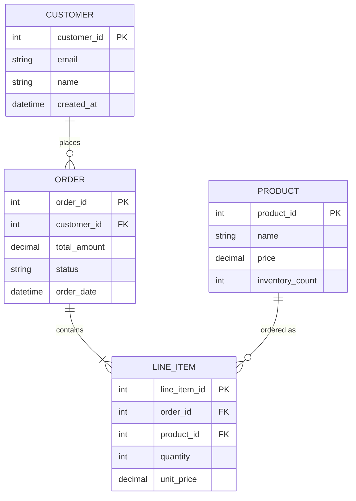
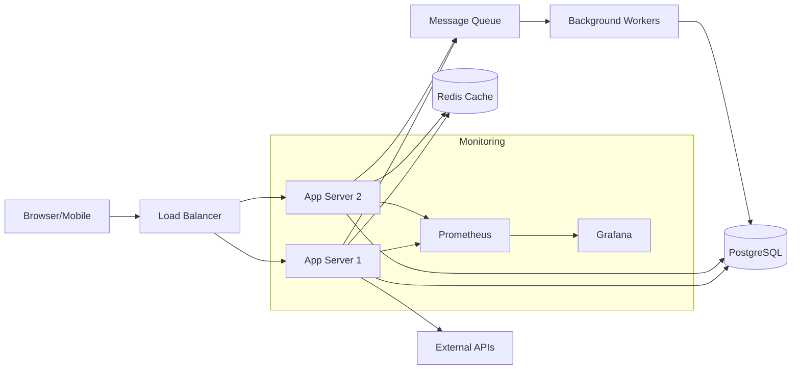
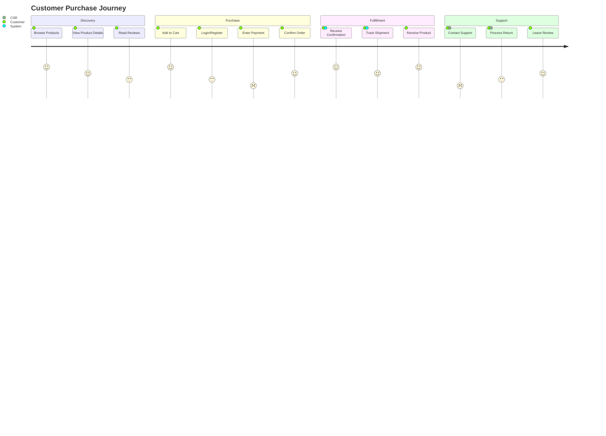
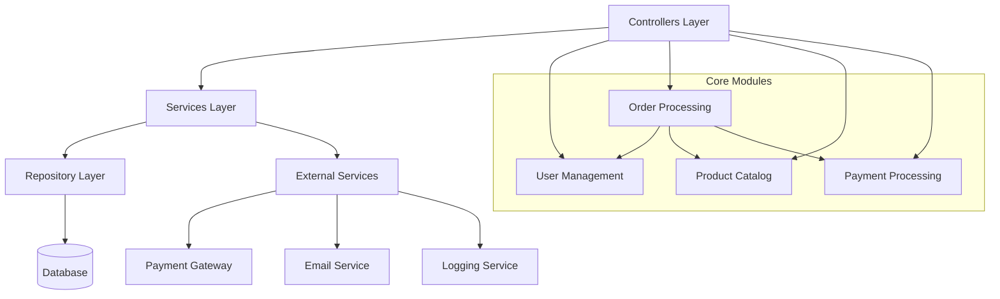
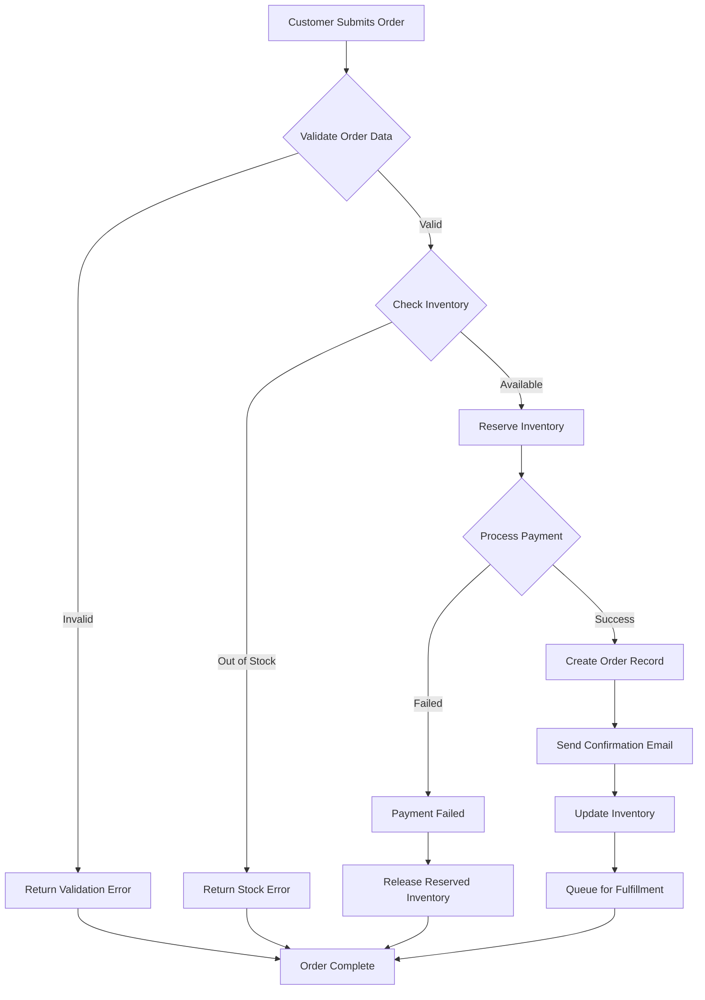
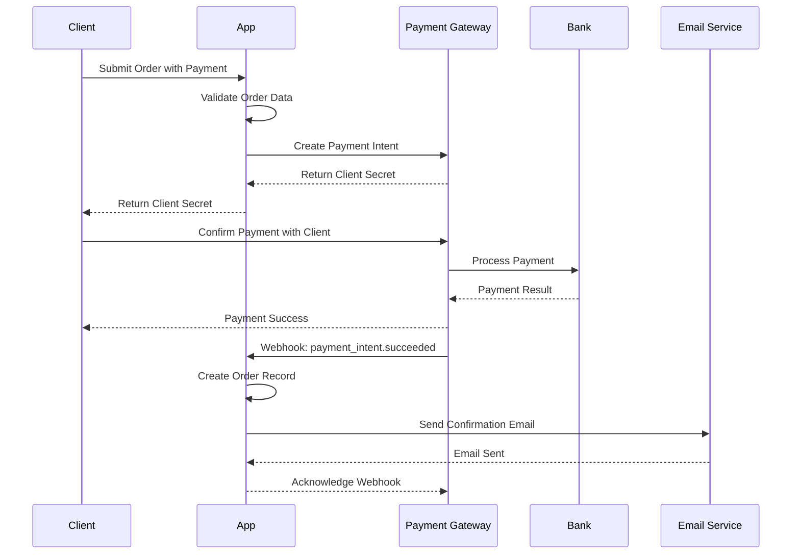

### Example Mermaid Diagrams

#### Database Schema ERD


#### System Architecture Overview


#### User Journey Map


#### API Endpoint Hierarchy
```mermaid
graph TD
    API[API Root /api/v1/]
    API --> Auth[Authentication /auth/*]
    API --> Users[User Management /users/*]
    API --> Products[Product Catalog /products/*]
    API --> Orders[Order Management /orders/*]
    API --> Admin[Admin /admin/*]
    
    Auth --> Login[POST /auth/login]
    Auth --> Logout[POST /auth/logout]
    Auth --> Refresh[POST /auth/refresh]
    
    Users --> Profile[GET /users/profile]
    Users --> Update[PUT /users/profile]
    
    Products --> List[GET /products]
    Products --> Details[GET /products/:id]
    Products --> Search[GET /products/search]
    
    Orders --> Create[POST /orders]
    Orders --> History[GET /orders]
    Orders --> Status[GET /orders/:id]
    
    Admin --> Analytics[GET /admin/analytics]
    Admin --> UserMgmt[/admin/users/*]
    Admin --> ProductMgmt[/admin/products/*]
```

#### Module Dependency Graph


#### Business Process Workflow


#### Integration Sequence Diagram

