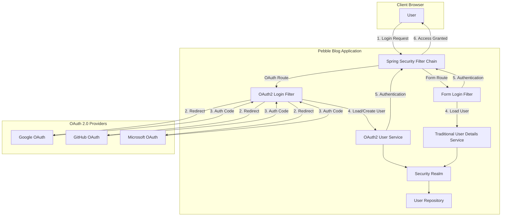
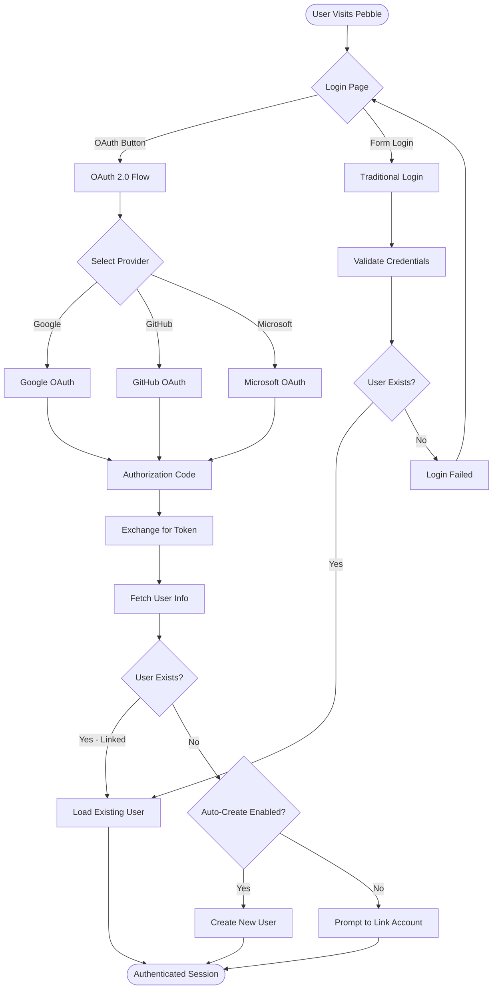
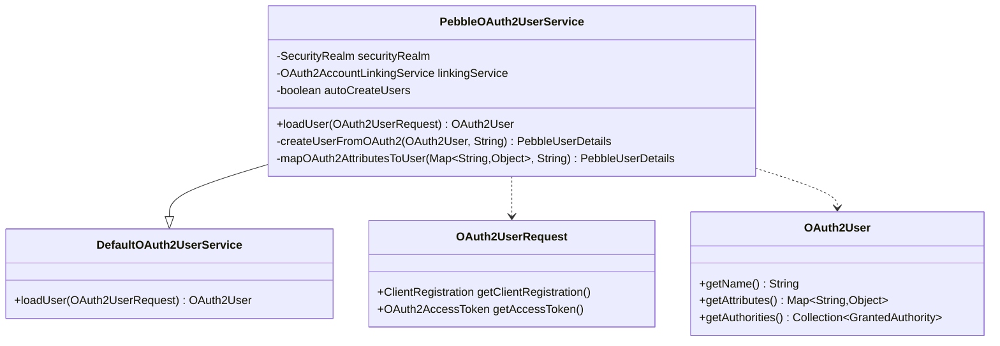
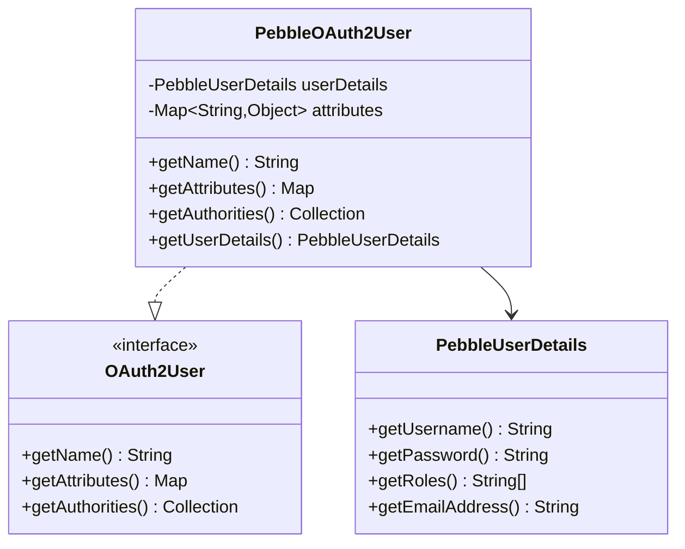
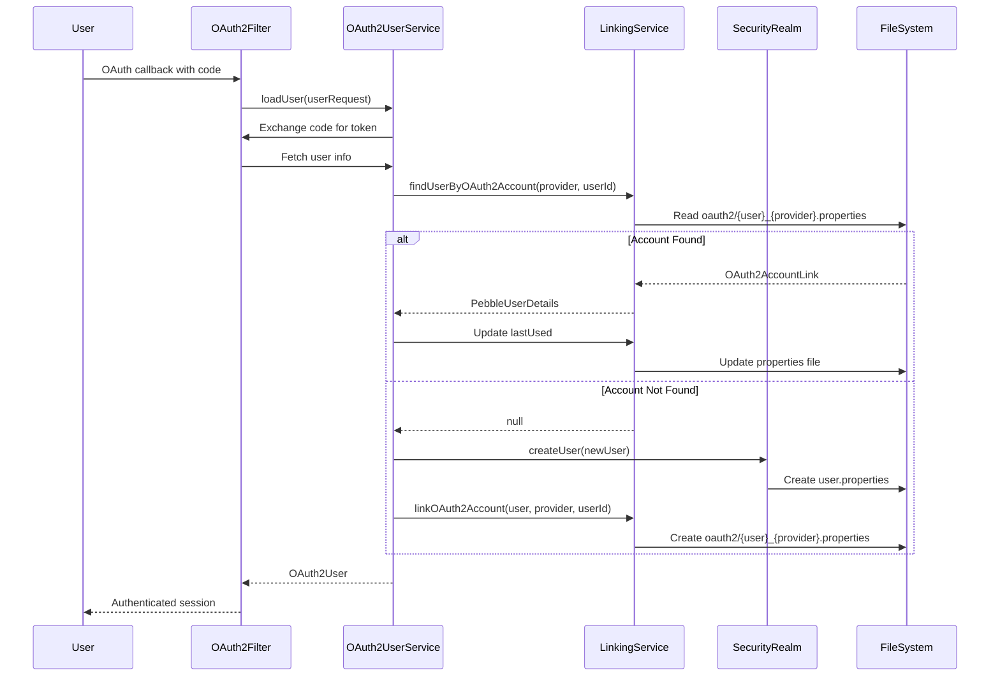
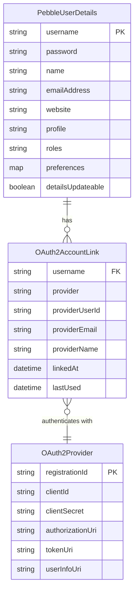
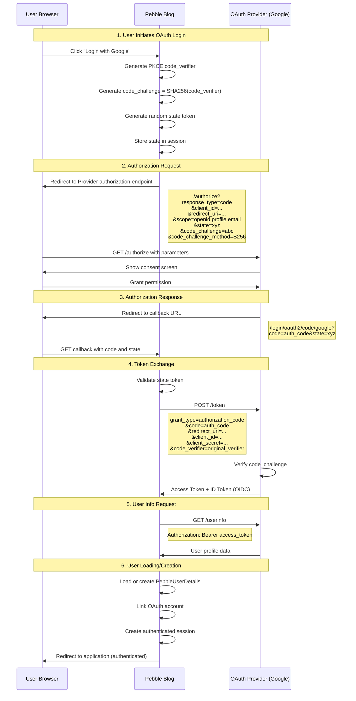
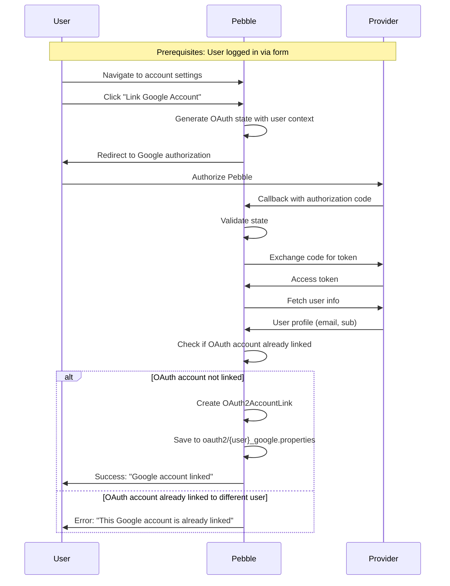
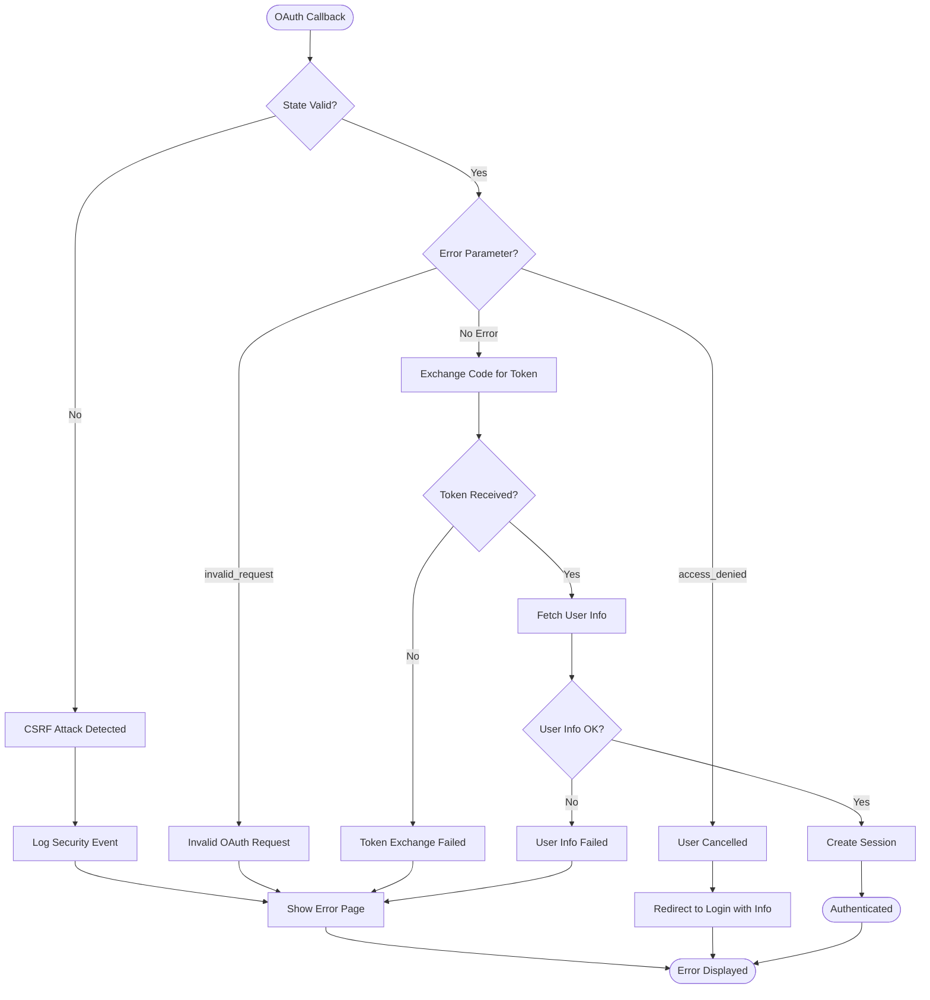
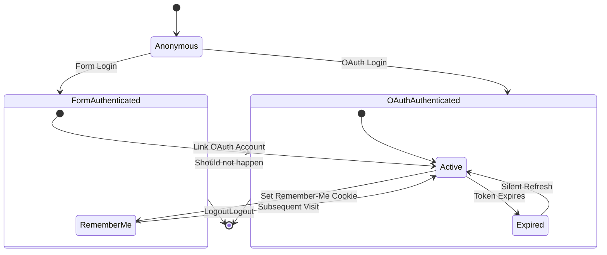

# OAuth 2.0 Authentication Architecture for Pebble Blog

## Document Information

- **Document Version**: 1.0
- **Date**: 2026-01-15
- **Phase**: Phase 5 - Modern Authentication
- **Status**: Design Proposal
- **Spring Security Version**: 6.2.2
- **Spring Version**: 6.1.14
- **Java Version**: 21 LTS

## Executive Summary

This document outlines the comprehensive architecture for adding OAuth 2.0 authentication to Pebble Blog while maintaining backward compatibility with existing form-based authentication. The design leverages Spring Security 6.2's native OAuth 2.0 client support to enable authentication through major identity providers (Google, GitHub, Microsoft) alongside the existing username/password authentication mechanism.

## 1. Architecture Overview

### 1.1 Current State

Pebble Blog currently implements:
- **Form-based authentication**: Username/password via Spring Security
- **Basic authentication**: For XML feed access
- **File-based security realm**: User credentials stored in `.properties` files
- **Password encoding**: BCrypt with automatic SHA-1 upgrade
- **Remember-me authentication**: Token-based persistent login
- **Role-based authorization**: BLOG_OWNER, BLOG_PUBLISHER, BLOG_CONTRIBUTOR, BLOG_ADMIN, BLOG_READER

### 1.2 Target State with OAuth 2.0

The enhanced system will support:
- **Hybrid authentication**: OAuth 2.0 AND traditional form-based login
- **Multiple OAuth providers**: Google, GitHub, Microsoft Azure AD
- **Account linking**: Link OAuth accounts to existing local accounts
- **Automatic account creation**: Create local accounts from OAuth profiles
- **Seamless user experience**: Single sign-on with fallback to local credentials
- **Security**: PKCE flow, state validation, CSRF protection

### 1.3 High-Level Architecture Diagram



### 1.4 Authentication Flow Decision Tree



## 2. Component Design

### 2.1 OAuth2 Security Configuration

#### 2.1.1 OAuth2ClientSecurityConfig

**Purpose**: Configure OAuth 2.0 client support in Spring Security 6.2

**Location**: `net.sourceforge.pebble.security.oauth2.OAuth2ClientSecurityConfig`

**Key Responsibilities**:
- Register OAuth 2.0 login filter
- Configure OAuth 2.0 client registrations
- Define authorization endpoints
- Configure token endpoints
- Set up user info endpoints

**Implementation Strategy**:

```java
@Configuration
@EnableWebSecurity
public class OAuth2ClientSecurityConfig {

    @Bean
    public SecurityFilterChain oauth2FilterChain(HttpSecurity http) throws Exception {
        http
            .oauth2Login(oauth2 -> oauth2
                .loginPage("/loginPage.action")
                .defaultSuccessUrl("/", true)
                .userInfoEndpoint(userInfo -> userInfo
                    .userService(oauth2UserService())
                    .oidcUserService(oidcUserService())
                )
                .successHandler(oauth2AuthenticationSuccessHandler())
                .failureHandler(oauth2AuthenticationFailureHandler())
            );
        return http.build();
    }

    @Bean
    public OAuth2UserService<OAuth2UserRequest, OAuth2User> oauth2UserService() {
        return new PebbleOAuth2UserService();
    }

    @Bean
    public OAuth2UserService<OidcUserRequest, OidcUser> oidcUserService() {
        return new PebbleOidcUserService();
    }
}
```

#### 2.1.2 Client Registration Configuration

**Purpose**: Define OAuth 2.0 client registrations for each provider

**Configuration Method**: Environment variables and application properties

**Client Registration Template**:

```yaml
spring:
  security:
    oauth2:
      client:
        registration:
          google:
            client-id: ${GOOGLE_CLIENT_ID}
            client-secret: ${GOOGLE_CLIENT_SECRET}
            scope:
              - openid
              - profile
              - email
            redirect-uri: "{baseUrl}/login/oauth2/code/{registrationId}"
            client-name: Google

          github:
            client-id: ${GITHUB_CLIENT_ID}
            client-secret: ${GITHUB_CLIENT_SECRET}
            scope:
              - user:email
              - read:user
            redirect-uri: "{baseUrl}/login/oauth2/code/{registrationId}"
            client-name: GitHub

          microsoft:
            client-id: ${MICROSOFT_CLIENT_ID}
            client-secret: ${MICROSOFT_CLIENT_SECRET}
            scope:
              - openid
              - profile
              - email
            redirect-uri: "{baseUrl}/login/oauth2/code/{registrationId}"
            client-name: Microsoft
            authorization-grant-type: authorization_code

        provider:
          microsoft:
            authorization-uri: https://login.microsoftonline.com/common/oauth2/v2.0/authorize
            token-uri: https://login.microsoftonline.com/common/oauth2/v2.0/token
            user-info-uri: https://graph.microsoft.com/oidc/userinfo
            jwk-set-uri: https://login.microsoftonline.com/common/discovery/v2.0/keys
            user-name-attribute: sub
```

### 2.2 OAuth2 User Service Components

#### 2.2.1 PebbleOAuth2UserService

**Purpose**: Load or create users from OAuth 2.0 providers (non-OIDC)

**Location**: `net.sourceforge.pebble.security.oauth2.PebbleOAuth2UserService`

**Class Diagram**:



**Implementation Outline**:

```java
public class PebbleOAuth2UserService extends DefaultOAuth2UserService {

    private SecurityRealm securityRealm;
    private OAuth2AccountLinkingService linkingService;
    private boolean autoCreateUsers = true;

    @Override
    public OAuth2User loadUser(OAuth2UserRequest userRequest)
            throws OAuth2AuthenticationException {

        // 1. Load user info from OAuth provider
        OAuth2User oauth2User = super.loadUser(userRequest);

        // 2. Extract provider and user identifier
        String registrationId = userRequest.getClientRegistration().getRegistrationId();
        String providerUserId = extractProviderUserId(oauth2User, registrationId);

        // 3. Check if OAuth account is linked to existing user
        PebbleUserDetails existingUser = linkingService.findUserByOAuth2Account(
            registrationId, providerUserId
        );

        if (existingUser != null) {
            // 4a. Return linked user with OAuth authorities
            return new PebbleOAuth2User(existingUser, oauth2User.getAttributes());
        }

        // 4b. Auto-create user or throw exception
        if (autoCreateUsers) {
            PebbleUserDetails newUser = createUserFromOAuth2(oauth2User, registrationId);
            linkingService.linkOAuth2Account(newUser, registrationId, providerUserId);
            return new PebbleOAuth2User(newUser, oauth2User.getAttributes());
        } else {
            throw new OAuth2AuthenticationException(
                "No linked account found. Please link your OAuth account."
            );
        }
    }

    private PebbleUserDetails createUserFromOAuth2(
            OAuth2User oauth2User, String provider) {
        // Extract user information from OAuth attributes
        Map<String, Object> attributes = oauth2User.getAttributes();

        String email = extractEmail(attributes, provider);
        String name = extractName(attributes, provider);
        String username = generateUsername(email, provider);

        // Create user with default BLOG_READER role
        return new PebbleUserDetails(
            username,
            null, // No password for OAuth users
            name,
            email,
            null, // website
            null, // profile
            new String[]{Constants.BLOG_READER_ROLE},
            new HashMap<>(),
            true // details updateable
        );
    }
}
```

#### 2.2.2 PebbleOidcUserService

**Purpose**: Load or create users from OpenID Connect providers

**Location**: `net.sourceforge.pebble.security.oauth2.PebbleOidcUserService`

**Key Differences from OAuth2UserService**:
- Uses `OidcUserRequest` instead of `OAuth2UserRequest`
- Has access to ID Token with standardized claims
- Can validate ID Token signatures
- Uses `OidcUser` interface with additional OIDC methods

**Implementation Outline**:

```java
public class PebbleOidcUserService extends OidcUserService {

    private SecurityRealm securityRealm;
    private OAuth2AccountLinkingService linkingService;

    @Override
    public OidcUser loadUser(OidcUserRequest userRequest)
            throws OAuth2AuthenticationException {

        // 1. Load OIDC user with ID token validation
        OidcUser oidcUser = super.loadUser(userRequest);

        // 2. Extract standardized OIDC claims
        String subject = oidcUser.getSubject();
        String email = oidcUser.getEmail();
        String name = oidcUser.getFullName();

        String registrationId = userRequest.getClientRegistration().getRegistrationId();

        // 3. Find or create user
        PebbleUserDetails user = linkingService.findUserByOAuth2Account(
            registrationId, subject
        );

        if (user == null) {
            user = createUserFromOidc(oidcUser, registrationId);
            linkingService.linkOAuth2Account(user, registrationId, subject);
        }

        return new PebbleOidcUser(user, oidcUser.getAttributes(),
                                  oidcUser.getIdToken(), oidcUser.getUserInfo());
    }
}
```

### 2.3 OAuth2 Domain Model Components

#### 2.3.1 PebbleOAuth2User

**Purpose**: Adapter to bridge OAuth2User and PebbleUserDetails

**Location**: `net.sourceforge.pebble.security.oauth2.PebbleOAuth2User`

**Class Diagram**:



#### 2.3.2 OAuth2AccountLink Entity

**Purpose**: Store OAuth account linkage information

**Location**: `net.sourceforge.pebble.domain.OAuth2AccountLink`

**Data Structure**:

```java
public class OAuth2AccountLink implements Serializable {

    private String username;              // Pebble username
    private String provider;              // OAuth provider: google, github, microsoft
    private String providerUserId;        // Provider's user identifier (sub claim)
    private String providerEmail;         // Email from provider
    private String providerName;          // Display name from provider
    private Date linkedAt;                // When link was created
    private Date lastUsed;                // Last successful OAuth login

    // Getters and setters
}
```

**Storage Format**: Properties file per user

```properties
# File: ${dataDir}/realm/oauth2/username_google.properties
username=jdoe
provider=google
providerUserId=117234567890123456789
providerEmail=john.doe@gmail.com
providerName=John Doe
linkedAt=2026-01-15T10:30:00Z
lastUsed=2026-01-15T14:22:00Z
```

### 2.4 OAuth2 Service Layer

#### 2.4.1 OAuth2AccountLinkingService

**Purpose**: Manage OAuth account linking and unlinking

**Location**: `net.sourceforge.pebble.security.oauth2.OAuth2AccountLinkingService`

**Interface**:

```java
public interface OAuth2AccountLinkingService {

    /**
     * Find user by OAuth provider and provider user ID
     */
    PebbleUserDetails findUserByOAuth2Account(String provider, String providerUserId)
        throws SecurityRealmException;

    /**
     * Link OAuth account to existing Pebble user
     */
    void linkOAuth2Account(PebbleUserDetails user, String provider,
                          String providerUserId, String email, String name)
        throws SecurityRealmException;

    /**
     * Unlink OAuth account from user
     */
    void unlinkOAuth2Account(String username, String provider)
        throws SecurityRealmException;

    /**
     * Get all OAuth accounts linked to user
     */
    Collection<OAuth2AccountLink> getLinkedAccounts(String username)
        throws SecurityRealmException;

    /**
     * Check if OAuth account is already linked
     */
    boolean isOAuth2AccountLinked(String provider, String providerUserId)
        throws SecurityRealmException;
}
```

**Implementation**: `DefaultOAuth2AccountLinkingService`

#### 2.4.2 OAuth2AccountLinkingService Sequence Diagram



### 2.5 Authentication Success and Failure Handlers

#### 2.5.1 OAuth2AuthenticationSuccessHandler

**Purpose**: Handle successful OAuth 2.0 authentication

**Location**: `net.sourceforge.pebble.security.oauth2.OAuth2AuthenticationSuccessHandler`

**Responsibilities**:
- Update OAuth2AccountLink lastUsed timestamp
- Synchronize user profile information from OAuth provider
- Redirect to saved request or default page
- Log successful OAuth authentication

#### 2.5.2 OAuth2AuthenticationFailureHandler

**Purpose**: Handle OAuth 2.0 authentication failures

**Location**: `net.sourceforge.pebble.security.oauth2.OAuth2AuthenticationFailureHandler`

**Responsibilities**:
- Log authentication failures with provider details
- Provide user-friendly error messages
- Redirect to login page with error parameter
- Handle specific OAuth errors (access_denied, invalid_grant, etc.)

## 3. Data Model Changes

### 3.1 PebbleUserDetails Extensions

**Current Schema**: Stored in `${dataDir}/realm/{username}.properties`

**OAuth Extensions**: Add new preference keys for OAuth metadata

```properties
# Existing fields
username=jdoe
password={bcrypt}$2a$10$...
name=John Doe
emailAddress=john.doe@example.com
website=https://example.com
profile=Blogger
roles=BLOG_OWNER,BLOG_PUBLISHER
detailsUpdateable=true

# NEW OAuth preference fields
preference.oauth2.enabled=true
preference.oauth2.providers=google,github
preference.oauth2.primary_provider=google
preference.oauth2.auto_sync_profile=true
preference.oauth2.profile_last_synced=2026-01-15T10:30:00Z
```

### 3.2 OAuth2 Account Links Storage

**Directory Structure**:

```
${dataDir}/
  realm/
    jdoe.properties                      # User credentials
    oauth2/                              # NEW directory
      jdoe_google.properties            # Google account link
      jdoe_github.properties            # GitHub account link
      alice_microsoft.properties        # Microsoft account link
      _index.properties                 # Fast lookup index
```

**Index File Format** (`_index.properties`):

```properties
# provider:providerUserId=username
google:117234567890123456789=jdoe
github:12345678=jdoe
microsoft:azure-ad-guid=alice
```

### 3.3 Entity Relationship Diagram



### 3.4 Database Migration Strategy

**Phase 1: Add OAuth2 Support (Non-Breaking)**
1. Create `oauth2/` directory in realm
2. Add OAuth preferences to existing users (optional)
3. Create `_index.properties` for fast lookups

**Phase 2: Optional Schema Evolution**
- Consider migrating to database (H2/PostgreSQL) if file-based storage becomes limiting
- Would enable better querying and atomic transactions
- Migration tool: `OAuth2RealmMigrationTool`

## 4. Security Flows

### 4.1 OAuth 2.0 Authorization Code Flow with PKCE

**Standard**: [RFC 6749](https://datatracker.ietf.org/doc/html/rfc6749) and [RFC 7636](https://datatracker.ietf.org/doc/html/rfc7636)

**Flow Diagram**:



### 4.2 Account Linking Flow

**Scenario**: Existing user wants to link OAuth account



### 4.3 OAuth Error Handling Flow



### 4.4 Security Considerations

#### 4.4.1 CSRF Protection

**Mechanism**: State parameter validation

```java
// OAuth2AuthorizationRequestResolver generates state
public class PebbleOAuth2AuthorizationRequestResolver
        extends DefaultOAuth2AuthorizationRequestResolver {

    @Override
    public OAuth2AuthorizationRequest resolve(HttpServletRequest request,
                                               String clientRegistrationId) {
        OAuth2AuthorizationRequest authRequest = super.resolve(request, clientRegistrationId);

        // Add custom state with CSRF token
        Map<String, Object> additionalParams = new HashMap<>(
            authRequest.getAdditionalParameters()
        );
        additionalParams.put("custom_state", generateSecureState());

        return OAuth2AuthorizationRequest.from(authRequest)
            .additionalParameters(additionalParams)
            .build();
    }

    private String generateSecureState() {
        // Generate cryptographically secure random state
        SecureRandom random = new SecureRandom();
        byte[] stateBytes = new byte[32];
        random.nextBytes(stateBytes);
        return Base64.getUrlEncoder().withoutPadding().encodeToString(stateBytes);
    }
}
```

#### 4.4.2 PKCE (Proof Key for Code Exchange)

**Spring Security 6.2 Default**: PKCE is enabled by default for all OAuth 2.0 authorization code flows

**Configuration**: No additional configuration needed

```yaml
# PKCE is automatically enabled
spring:
  security:
    oauth2:
      client:
        registration:
          google:
            authorization-grant-type: authorization_code  # PKCE enabled
```

**How it works**:
1. Spring Security generates `code_verifier` (random string)
2. Computes `code_challenge = SHA256(code_verifier)`
3. Sends `code_challenge` in authorization request
4. Sends `code_verifier` in token exchange request
5. Provider validates `SHA256(code_verifier) == code_challenge`

#### 4.4.3 Token Storage Security

**Security Requirements**:
- Never store OAuth access tokens in browser cookies
- Never log access tokens or refresh tokens
- Store tokens in server-side session only
- Use secure session cookies with HttpOnly and SameSite flags

**Configuration**:

```java
@Bean
public SecurityFilterChain securityFilterChain(HttpSecurity http) throws Exception {
    http
        .sessionManagement(session -> session
            .sessionCreationPolicy(SessionCreationPolicy.IF_REQUIRED)
            .maximumSessions(1)
            .maxSessionsPreventsLogin(false)
        )
        .csrf(csrf -> csrf
            .csrfTokenRepository(CookieCsrfTokenRepository.withHttpOnlyFalse())
        );

    return http.build();
}

@Bean
public CookieSerializer cookieSerializer() {
    DefaultCookieSerializer serializer = new DefaultCookieSerializer();
    serializer.setCookieName("PEBBLE_SESSION");
    serializer.setUseHttpOnlyCookie(true);
    serializer.setUseSecureCookie(true);  // HTTPS only
    serializer.setSameSite("Lax");
    return serializer;
}
```

## 5. Session Management

### 5.1 Session Strategy

**Approach**: Unified session management for both OAuth and form-based authentication

**Session Attributes**:
```java
public class SessionAttributes {
    public static final String OAUTH_AUTHENTICATED = "oauth2.authenticated";
    public static final String OAUTH_PROVIDER = "oauth2.provider";
    public static final String OAUTH_SUB = "oauth2.subject";
    public static final String OAUTH_EMAIL = "oauth2.email";
    public static final String AUTH_TYPE = "auth.type"; // "oauth2" or "form"
}
```

**Session Lifecycle**:



### 5.2 Session Synchronization

**Challenge**: Keep OAuth user info synchronized with provider

**Strategy**: Periodic background refresh (optional)

```java
@Service
public class OAuth2ProfileSyncService {

    @Scheduled(cron = "0 0 2 * * ?") // Daily at 2 AM
    public void syncOAuth2Profiles() {
        Collection<PebbleUserDetails> users = securityRealm.getUsers();

        for (PebbleUserDetails user : users) {
            if (hasOAuth2Linked(user)) {
                for (OAuth2AccountLink link : getLinkedAccounts(user.getUsername())) {
                    try {
                        syncProfileFromProvider(user, link);
                    } catch (OAuth2AuthenticationException e) {
                        log.warn("Failed to sync OAuth profile for user: " +
                                 user.getUsername(), e);
                    }
                }
            }
        }
    }
}
```

### 5.3 Remember-Me with OAuth

**Consideration**: Remember-Me tokens work differently with OAuth

**Options**:
1. **No Remember-Me for OAuth**: Require re-authentication through provider
2. **Session-based Remember-Me**: Use refresh tokens (if provider supports)
3. **Hybrid**: Allow Remember-Me for form login, but not OAuth

**Recommended**: Option 1 (No Remember-Me for OAuth) for security

```java
@Bean
public RememberMeServices rememberMeServices() {
    TokenBasedRememberMeServices rememberMe =
        new TokenBasedRememberMeServices("pebble", userDetailsService);

    // Only apply to form login
    rememberMe.setAlwaysRemember(false);
    rememberMe.setTokenValiditySeconds(86400 * 30); // 30 days

    return rememberMe;
}
```

## 6. Error Handling and Fallback Strategies

### 6.1 OAuth Provider Unavailability

**Scenario**: OAuth provider (Google, GitHub, Microsoft) is down

**Fallback Strategy**:
1. Detect provider unavailability via connection timeout
2. Log error and notify administrators
3. Disable OAuth login buttons temporarily
4. Allow users to login via form authentication
5. Show maintenance notice for OAuth

**Implementation**:

```java
@ControllerAdvice
public class OAuth2ExceptionHandler {

    @ExceptionHandler(OAuth2AuthenticationException.class)
    public ModelAndView handleOAuth2Error(OAuth2AuthenticationException ex) {
        ModelAndView mav = new ModelAndView("loginPage");

        if (isProviderUnavailable(ex)) {
            mav.addObject("oauth2.unavailable", true);
            mav.addObject("error", "OAuth provider temporarily unavailable. " +
                                   "Please use username/password login.");
        } else {
            mav.addObject("error", "Authentication failed: " + ex.getMessage());
        }

        return mav;
    }

    private boolean isProviderUnavailable(OAuth2AuthenticationException ex) {
        Throwable cause = ex.getCause();
        return cause instanceof ConnectException ||
               cause instanceof SocketTimeoutException;
    }
}
```

### 6.2 Client Secret Rotation

**Requirement**: Support OAuth client secret rotation without downtime

**Strategy**:
1. Support multiple client secrets via fallback configuration
2. Attempt primary secret first, then fallback secrets
3. Log which secret was used for monitoring

**Configuration**:

```yaml
pebble:
  oauth2:
    google:
      client-id: ${GOOGLE_CLIENT_ID}
      client-secrets:
        - ${GOOGLE_CLIENT_SECRET}        # Current secret
        - ${GOOGLE_CLIENT_SECRET_OLD}    # Previous secret (grace period)
```

### 6.3 Account Takeover Prevention

**Threat**: Attacker links their OAuth account to victim's Pebble account

**Mitigation**:
1. **Require re-authentication**: User must enter password before linking OAuth
2. **Email verification**: Send confirmation email when OAuth account linked
3. **Audit log**: Record all OAuth linking/unlinking events
4. **Rate limiting**: Limit OAuth linking attempts per user

**Implementation**:

```java
@PostMapping("/account/link-oauth")
public String linkOAuthAccount(@RequestParam String provider,
                               @RequestParam String password,
                               Principal principal) {

    // 1. Re-authenticate user with password
    Authentication auth = authenticationManager.authenticate(
        new UsernamePasswordAuthenticationToken(
            principal.getName(), password
        )
    );

    if (!auth.isAuthenticated()) {
        return "redirect:/account?error=invalid_password";
    }

    // 2. Initiate OAuth flow with linking context
    return "redirect:/oauth2/authorization/" + provider +
           "?action=link&state=" + generateSecureState();
}
```

### 6.4 Error Code Mapping

| OAuth Error Code | User-Friendly Message | Action |
|------------------|----------------------|--------|
| `access_denied` | You cancelled the login process | Return to login |
| `invalid_request` | Invalid OAuth configuration | Contact administrator |
| `unauthorized_client` | Application not authorized | Contact administrator |
| `unsupported_response_type` | OAuth configuration error | Contact administrator |
| `invalid_scope` | Insufficient permissions | Contact administrator |
| `server_error` | Provider experiencing issues | Try again later |
| `temporarily_unavailable` | Provider temporarily down | Use form login |
| `account_already_linked` | This OAuth account is already linked | Contact support |
| `email_conflict` | Email already registered | Use existing account |

## 7. Configuration Management

### 7.1 Environment Variables

**Required Environment Variables**:

```bash
# Google OAuth 2.0
GOOGLE_CLIENT_ID=your-client-id.apps.googleusercontent.com
GOOGLE_CLIENT_SECRET=your-client-secret

# GitHub OAuth 2.0
GITHUB_CLIENT_ID=your-github-client-id
GITHUB_CLIENT_SECRET=your-github-client-secret

# Microsoft OAuth 2.0
MICROSOFT_CLIENT_ID=your-microsoft-client-id
MICROSOFT_CLIENT_SECRET=your-microsoft-client-secret

# Optional: OAuth feature flags
PEBBLE_OAUTH2_ENABLED=true
PEBBLE_OAUTH2_AUTO_CREATE_USERS=true
PEBBLE_OAUTH2_AUTO_SYNC_PROFILE=true
PEBBLE_OAUTH2_PROVIDERS=google,github,microsoft
```

### 7.2 Application Properties Configuration

**Location**: `src/main/resources/application.yml`

```yaml
pebble:
  oauth2:
    enabled: ${PEBBLE_OAUTH2_ENABLED:true}
    auto-create-users: ${PEBBLE_OAUTH2_AUTO_CREATE_USERS:true}
    auto-sync-profile: ${PEBBLE_OAUTH2_AUTO_SYNC_PROFILE:false}
    enabled-providers: ${PEBBLE_OAUTH2_PROVIDERS:google,github,microsoft}

    # Default role for OAuth-created users
    default-role: BLOG_READER

    # Profile sync settings
    profile-sync:
      enabled: ${PEBBLE_OAUTH2_AUTO_SYNC_PROFILE:false}
      schedule-cron: "0 0 2 * * ?"  # Daily at 2 AM
      sync-email: true
      sync-name: true
      sync-picture: false

    # Security settings
    security:
      require-verified-email: true
      allow-account-linking: true
      require-password-for-linking: true
      max-linked-accounts: 3

spring:
  security:
    oauth2:
      client:
        registration:
          google:
            client-id: ${GOOGLE_CLIENT_ID}
            client-secret: ${GOOGLE_CLIENT_SECRET}
            scope:
              - openid
              - profile
              - email
            redirect-uri: "{baseUrl}/login/oauth2/code/{registrationId}"
            client-name: Google
            provider: google

          github:
            client-id: ${GITHUB_CLIENT_ID}
            client-secret: ${GITHUB_CLIENT_SECRET}
            scope:
              - user:email
              - read:user
            redirect-uri: "{baseUrl}/login/oauth2/code/{registrationId}"
            client-name: GitHub
            provider: github

          microsoft:
            client-id: ${MICROSOFT_CLIENT_ID}
            client-secret: ${MICROSOFT_CLIENT_SECRET}
            scope:
              - openid
              - profile
              - email
            redirect-uri: "{baseUrl}/login/oauth2/code/{registrationId}"
            client-name: Microsoft
            provider: microsoft
            authorization-grant-type: authorization_code

        provider:
          google:
            authorization-uri: https://accounts.google.com/o/oauth2/v2/auth
            token-uri: https://oauth2.googleapis.com/token
            user-info-uri: https://www.googleapis.com/oauth2/v3/userinfo
            jwk-set-uri: https://www.googleapis.com/oauth2/v3/certs
            user-name-attribute: sub

          github:
            authorization-uri: https://github.com/login/oauth/authorize
            token-uri: https://github.com/login/oauth/access_token
            user-info-uri: https://api.github.com/user
            user-name-attribute: id

          microsoft:
            authorization-uri: https://login.microsoftonline.com/common/oauth2/v2.0/authorize
            token-uri: https://login.microsoftonline.com/common/oauth2/v2.0/token
            user-info-uri: https://graph.microsoft.com/oidc/userinfo
            jwk-set-uri: https://login.microsoftonline.com/common/discovery/v2.0/keys
            user-name-attribute: sub
```

### 7.3 OAuth Provider Registration Guide

#### 7.3.1 Google Cloud Console Setup

**Steps**:
1. Go to [Google Cloud Console](https://console.cloud.google.com/)
2. Create new project or select existing
3. Enable "Google+ API"
4. Navigate to "Credentials" → "Create Credentials" → "OAuth 2.0 Client ID"
5. Application type: "Web application"
6. Authorized redirect URIs:
   - `http://localhost:8080/login/oauth2/code/google` (development)
   - `https://yourblog.com/login/oauth2/code/google` (production)
7. Copy Client ID and Client Secret

**Scopes Required**:
- `openid`: OIDC identity
- `profile`: Basic profile (name)
- `email`: Email address

#### 7.3.2 GitHub OAuth App Setup

**Steps**:
1. Go to [GitHub Settings](https://github.com/settings/developers)
2. Click "OAuth Apps" → "New OAuth App"
3. Fill in:
   - Application name: "Pebble Blog"
   - Homepage URL: `https://yourblog.com`
   - Authorization callback URL: `https://yourblog.com/login/oauth2/code/github`
4. Copy Client ID and Client Secret

**Scopes Required**:
- `user:email`: Access user email addresses
- `read:user`: Read user profile data

#### 7.3.3 Microsoft Azure AD Setup

**Steps**:
1. Go to [Azure Portal](https://portal.azure.com/)
2. Navigate to "Azure Active Directory" → "App registrations"
3. Click "New registration"
4. Fill in:
   - Name: "Pebble Blog"
   - Supported account types: "Accounts in any organizational directory and personal Microsoft accounts"
   - Redirect URI: `https://yourblog.com/login/oauth2/code/microsoft`
5. Under "Certificates & secrets", create new client secret
6. Under "API permissions", add:
   - Microsoft Graph → Delegated → openid, profile, email
7. Copy Application (client) ID and client secret

### 7.4 Configuration Validation

**Validation Service**: Validate OAuth configuration on startup

```java
@Component
public class OAuth2ConfigurationValidator implements ApplicationListener<ContextRefreshedEvent> {

    @Autowired(required = false)
    private ClientRegistrationRepository clientRegistrationRepository;

    @Override
    public void onApplicationEvent(ContextRefreshedEvent event) {
        if (clientRegistrationRepository == null) {
            log.warn("OAuth2 is not configured. Form-based authentication only.");
            return;
        }

        // Validate each provider
        validateProvider("google");
        validateProvider("github");
        validateProvider("microsoft");
    }

    private void validateProvider(String registrationId) {
        try {
            ClientRegistration registration =
                clientRegistrationRepository.findByRegistrationId(registrationId);

            if (registration == null) {
                log.warn("OAuth2 provider '{}' is not configured", registrationId);
                return;
            }

            // Validate required fields
            validateNotBlank(registration.getClientId(), "Client ID");
            validateNotBlank(registration.getClientSecret(), "Client Secret");
            validateNotBlank(registration.getRedirectUri(), "Redirect URI");

            log.info("OAuth2 provider '{}' configured successfully", registrationId);

        } catch (Exception e) {
            log.error("Invalid OAuth2 configuration for provider: " + registrationId, e);
        }
    }
}
```

## 8. Implementation Roadmap

### 8.1 Phase 1: Foundation (Week 1-2)

**Objectives**:
- Set up OAuth 2.0 dependencies
- Create basic OAuth configuration
- Implement OAuth2AccountLink entity and storage

**Tasks**:
1. Add Spring Security OAuth 2.0 dependencies to `pom.xml`
2. Create `OAuth2ClientSecurityConfig` class
3. Create `OAuth2AccountLink` domain class
4. Create `OAuth2AccountLinkingService` interface and implementation
5. Create `oauth2/` directory structure in realm
6. Implement index-based lookup for OAuth accounts

**Deliverables**:
- Maven dependencies configured
- OAuth security config skeleton
- OAuth account storage ready

### 8.2 Phase 2: Google OAuth Integration (Week 3)

**Objectives**:
- Implement full Google OAuth flow
- User creation from Google accounts
- Account linking functionality

**Tasks**:
1. Configure Google client registration
2. Implement `PebbleOAuth2UserService`
3. Implement `PebbleOidcUserService`
4. Create `PebbleOAuth2User` adapter
5. Implement OAuth success/failure handlers
6. Add "Login with Google" button to login page
7. Create account linking UI

**Deliverables**:
- Working Google OAuth login
- User auto-creation from Google
- Account linking functional

### 8.3 Phase 3: GitHub and Microsoft Support (Week 4)

**Objectives**:
- Add GitHub OAuth support
- Add Microsoft OAuth support
- Test multi-provider scenarios

**Tasks**:
1. Configure GitHub client registration
2. Configure Microsoft client registration
3. Test switching between providers
4. Test linking multiple providers to one account
5. Implement provider-specific attribute mapping

**Deliverables**:
- All three providers working
- Multi-provider linking tested

### 8.4 Phase 4: Error Handling and Security (Week 5)

**Objectives**:
- Implement comprehensive error handling
- Add security hardening
- Implement audit logging

**Tasks**:
1. Create `OAuth2ExceptionHandler`
2. Implement state validation
3. Add CSRF protection verification
4. Implement rate limiting for OAuth endpoints
5. Add OAuth audit logging
6. Create error message mappings

**Deliverables**:
- Robust error handling
- Security hardening complete
- Audit logging functional

### 8.5 Phase 5: UI/UX Enhancement (Week 6)

**Objectives**:
- Polish login page UI
- Create account management UI
- Add OAuth indicators

**Tasks**:
1. Redesign login page with OAuth buttons
2. Create "My OAuth Accounts" page
3. Add OAuth badge to user profile
4. Implement unlink OAuth account UI
5. Add OAuth login statistics

**Deliverables**:
- Modern login page
- Complete account management UI

### 8.6 Phase 6: Testing and Documentation (Week 7-8)

**Objectives**:
- Comprehensive testing
- Documentation
- Deployment preparation

**Tasks**:
1. Unit tests for all OAuth services
2. Integration tests for OAuth flows
3. Security testing (penetration tests)
4. Performance testing
5. Write user documentation
6. Write administrator documentation
7. Create deployment guide

**Deliverables**:
- 90%+ test coverage
- Complete documentation
- Deployment-ready code

## 9. Testing Strategy

### 9.1 Unit Tests

**Test Coverage Areas**:

```java
// OAuth2AccountLinkingService tests
public class OAuth2AccountLinkingServiceTest {

    @Test
    public void testFindUserByOAuth2Account_Found() {
        // Test finding existing linked account
    }

    @Test
    public void testFindUserByOAuth2Account_NotFound() {
        // Test when OAuth account not linked
    }

    @Test
    public void testLinkOAuth2Account_Success() {
        // Test successful account linking
    }

    @Test
    public void testLinkOAuth2Account_AlreadyLinked() {
        // Test linking already-linked account (should fail)
    }

    @Test
    public void testUnlinkOAuth2Account_Success() {
        // Test successful unlinking
    }

    @Test
    public void testUnlinkOAuth2Account_LastAccount() {
        // Test unlinking last OAuth account (may require password)
    }
}

// PebbleOAuth2UserService tests
public class PebbleOAuth2UserServiceTest {

    @Test
    public void testLoadUser_ExistingLinkedAccount() {
        // Test loading user with existing OAuth link
    }

    @Test
    public void testLoadUser_AutoCreateNewUser() {
        // Test auto-creating user from OAuth
    }

    @Test
    public void testLoadUser_EmailConflict() {
        // Test when OAuth email conflicts with existing user
    }

    @Test
    public void testLoadUser_ProviderUnavailable() {
        // Test handling provider errors
    }
}
```

### 9.2 Integration Tests

**Test Scenarios**:

```java
@SpringBootTest
@AutoConfigureMockMvc
public class OAuth2LoginIntegrationTest {

    @Autowired
    private MockMvc mockMvc;

    @Test
    public void testOAuth2Login_GoogleSuccess() {
        // Test complete Google OAuth flow
        // 1. Initiate OAuth
        // 2. Mock provider callback
        // 3. Verify user created
        // 4. Verify session established
    }

    @Test
    public void testOAuth2Login_StateValidationFailure() {
        // Test CSRF protection via invalid state
    }

    @Test
    public void testAccountLinking_Success() {
        // Test linking OAuth to existing account
    }

    @Test
    public void testAccountLinking_RequiresReauthentication() {
        // Test that linking requires password confirmation
    }
}
```

### 9.3 Security Tests

**Security Testing Checklist**:

- [ ] CSRF protection (state parameter validation)
- [ ] OAuth state tampering detection
- [ ] Account takeover prevention
- [ ] Session fixation protection
- [ ] XSS in OAuth callback parameters
- [ ] Open redirect vulnerability in redirect_uri
- [ ] Token leakage in logs
- [ ] Token leakage in browser history
- [ ] Man-in-the-middle protection (HTTPS)
- [ ] Rate limiting on OAuth endpoints

### 9.4 Manual Testing Checklist

**OAuth Login Flows**:
- [ ] Login with Google (first time)
- [ ] Login with Google (returning user)
- [ ] Login with GitHub (first time)
- [ ] Login with Microsoft (first time)
- [ ] User cancels OAuth consent
- [ ] OAuth provider returns error
- [ ] Network timeout during OAuth
- [ ] Invalid client configuration

**Account Linking**:
- [ ] Link Google to existing account
- [ ] Link GitHub to existing account
- [ ] Link Microsoft to existing account
- [ ] Attempt to link already-linked account
- [ ] Unlink OAuth account
- [ ] Unlink last OAuth account (ensure password exists)

**Error Scenarios**:
- [ ] Google service outage
- [ ] Invalid client secret
- [ ] Expired authorization code
- [ ] Token exchange failure
- [ ] User info fetch failure
- [ ] Email conflict during auto-creation

## 10. Monitoring and Observability

### 10.1 OAuth Metrics

**Metrics to Track**:

```java
@Component
public class OAuth2MetricsCollector {

    private final MeterRegistry meterRegistry;

    // Counter metrics
    private final Counter googleLogins;
    private final Counter githubLogins;
    private final Counter microsoftLogins;
    private final Counter oauth2Failures;
    private final Counter accountLinked;
    private final Counter accountUnlinked;

    // Timer metrics
    private final Timer oauth2LoginDuration;
    private final Timer tokenExchangeDuration;

    public OAuth2MetricsCollector(MeterRegistry meterRegistry) {
        this.meterRegistry = meterRegistry;

        this.googleLogins = Counter.builder("oauth2.login")
            .tag("provider", "google")
            .description("Number of Google OAuth logins")
            .register(meterRegistry);

        this.oauth2LoginDuration = Timer.builder("oauth2.login.duration")
            .description("OAuth login flow duration")
            .register(meterRegistry);
    }

    public void recordLogin(String provider) {
        meterRegistry.counter("oauth2.login", "provider", provider).increment();
    }

    public void recordFailure(String provider, String error) {
        meterRegistry.counter("oauth2.failure",
            "provider", provider,
            "error", error).increment();
    }
}
```

### 10.2 Logging Strategy

**Log Levels**:

```java
public class OAuth2Logger {

    private static final Logger log = LoggerFactory.getLogger(OAuth2Logger.class);

    // INFO: Normal OAuth operations
    public static void logOAuth2Login(String username, String provider) {
        log.info("OAuth2 login successful: user={}, provider={}", username, provider);
    }

    // WARN: Suspicious activity
    public static void logStateValidationFailure(String state) {
        log.warn("OAuth2 state validation failed: state={}", state);
    }

    // ERROR: OAuth failures
    public static void logOAuth2Error(String provider, Exception e) {
        log.error("OAuth2 authentication failed: provider={}", provider, e);
    }

    // DEBUG: Detailed OAuth flow
    public static void logTokenExchange(String provider, boolean success) {
        log.debug("OAuth2 token exchange: provider={}, success={}", provider, success);
    }
}
```

### 10.3 Health Checks

**OAuth Health Endpoint**:

```java
@Component
public class OAuth2HealthIndicator implements HealthIndicator {

    @Autowired
    private ClientRegistrationRepository clientRegistrationRepository;

    @Override
    public Health health() {
        Map<String, Object> details = new HashMap<>();
        boolean allHealthy = true;

        for (String provider : Arrays.asList("google", "github", "microsoft")) {
            boolean healthy = checkProviderHealth(provider);
            details.put(provider, healthy ? "UP" : "DOWN");
            allHealthy = allHealthy && healthy;
        }

        return allHealthy ?
            Health.up().withDetails(details).build() :
            Health.down().withDetails(details).build();
    }

    private boolean checkProviderHealth(String provider) {
        try {
            ClientRegistration registration =
                clientRegistrationRepository.findByRegistrationId(provider);
            return registration != null &&
                   registration.getClientId() != null &&
                   !registration.getClientId().isEmpty();
        } catch (Exception e) {
            return false;
        }
    }
}
```

## 11. Migration Strategy

### 11.1 Deployment Plan

**Zero-Downtime Deployment**:

1. **Pre-Deployment**:
   - Set up OAuth applications in Google/GitHub/Microsoft
   - Configure environment variables on target servers
   - Back up existing realm directory
   - Create `oauth2/` directory structure

2. **Deployment**:
   - Deploy new WAR file
   - Verify OAuth configuration on startup
   - Test OAuth login with test account
   - Monitor logs for errors

3. **Post-Deployment**:
   - Gradually enable OAuth for users
   - Monitor OAuth success/failure rates
   - Collect user feedback
   - Document any issues

### 11.2 Rollback Plan

**If OAuth Causes Issues**:

1. **Quick Rollback**:
   - Set `PEBBLE_OAUTH2_ENABLED=false`
   - Restart application
   - Users continue with form-based login

2. **Full Rollback**:
   - Redeploy previous WAR file
   - Remove OAuth configuration
   - Preserve `oauth2/` directory for future retry

### 11.3 User Communication

**Announcement Template**:

```
Subject: New Login Options: Sign in with Google, GitHub, or Microsoft

Dear Pebble Blog Users,

We're excited to announce new login options! You can now sign in to Pebble Blog using:

- Google Account
- GitHub Account
- Microsoft Account

Benefits:
- Faster login with your existing accounts
- No need to remember another password
- Enhanced security with industry-leading authentication

Your existing username/password will continue to work as before.

To link your existing account with OAuth:
1. Log in with your username/password
2. Go to Account Settings
3. Click "Link Google/GitHub/Microsoft Account"

Questions? Visit our help center or contact support.

Happy blogging!
The Pebble Team
```

## 12. Security Considerations

### 12.1 Threat Model

**Threats and Mitigations**:

| Threat | Mitigation |
|--------|-----------|
| **CSRF Attack** | State parameter validation, CSRF tokens |
| **Account Takeover** | Require password for account linking |
| **Token Leakage** | Never log tokens, secure session storage |
| **Man-in-the-Middle** | Enforce HTTPS, validate OAuth provider certificates |
| **Open Redirect** | Whitelist redirect URIs, validate redirect_uri parameter |
| **Session Fixation** | Regenerate session ID on authentication |
| **Email Enumeration** | Generic error messages for OAuth failures |
| **Brute Force** | Rate limiting on OAuth endpoints |

### 12.2 Security Best Practices

**Implementation Checklist**:

- [ ] Use HTTPS for all OAuth endpoints
- [ ] Validate OAuth state parameter
- [ ] Implement PKCE for all authorization code flows
- [ ] Never log OAuth tokens
- [ ] Secure session cookies (HttpOnly, Secure, SameSite)
- [ ] Implement rate limiting
- [ ] Require password for account linking
- [ ] Send email notifications for OAuth linking/unlinking
- [ ] Implement audit logging for OAuth events
- [ ] Regular security audits and penetration testing

### 12.3 Compliance

**GDPR Considerations**:
- OAuth profile data is personal data
- Obtain user consent before auto-creating accounts
- Allow users to view/export OAuth data
- Allow users to delete OAuth links
- Document data processing in privacy policy

**Data Retention**:
- Store minimum necessary OAuth data
- Retain OAuth audit logs for 90 days
- Anonymize old OAuth logs after retention period

## 13. Performance Considerations

### 13.1 OAuth Flow Performance

**Performance Targets**:
- Authorization redirect: < 200ms
- Token exchange: < 500ms
- User info fetch: < 300ms
- Account lookup: < 50ms
- Session creation: < 100ms
- **Total OAuth login time: < 2 seconds**

### 13.2 Caching Strategy

**Cacheable Data**:
- Client registrations (in-memory, indefinite)
- OAuth provider metadata (in-memory, 24 hours)
- OAuth account index (in-memory, reload on change)

```java
@Configuration
@EnableCaching
public class OAuth2CacheConfig {

    @Bean
    public CacheManager cacheManager() {
        SimpleCacheManager cacheManager = new SimpleCacheManager();
        cacheManager.setCaches(Arrays.asList(
            new ConcurrentMapCache("oauth2.accounts"),
            new ConcurrentMapCache("oauth2.providers")
        ));
        return cacheManager;
    }
}
```

### 13.3 Scalability

**Horizontal Scaling Considerations**:
- OAuth state stored in session (requires sticky sessions or shared session store)
- OAuth account index can be cached per instance
- Consider Redis for shared session storage in clustered deployments

## 14. Appendices

### Appendix A: OAuth 2.0 Terminology

| Term | Definition |
|------|------------|
| **Authorization Server** | OAuth provider (Google, GitHub, Microsoft) |
| **Client** | Pebble Blog application |
| **Resource Owner** | End user |
| **Authorization Code** | Temporary code exchanged for access token |
| **Access Token** | Token used to access user info |
| **ID Token** | JWT containing user identity claims (OIDC) |
| **Scope** | Permissions requested from user |
| **State** | CSRF protection parameter |
| **PKCE** | Proof Key for Code Exchange (security extension) |
| **Redirect URI** | Callback URL after authorization |

### Appendix B: OAuth Provider Comparison

| Feature | Google | GitHub | Microsoft |
|---------|--------|--------|-----------|
| **Protocol** | OAuth 2.0 + OIDC | OAuth 2.0 | OAuth 2.0 + OIDC |
| **User ID** | `sub` claim | `id` | `sub` claim |
| **Email** | Always provided | May require verification | Always provided |
| **Profile Picture** | `picture` claim | `avatar_url` | Not in standard claims |
| **Name** | `name` claim | `name` | `name` claim |
| **Email Verified** | `email_verified` | N/A | `email_verified` |
| **Token Expiry** | 3600s | No expiration | 3600s |
| **Refresh Tokens** | Optional | Not supported | Optional |

### Appendix C: Sample OAuth Configurations

**Development Configuration** (`application-dev.yml`):

```yaml
pebble:
  oauth2:
    enabled: true
    auto-create-users: true

spring:
  security:
    oauth2:
      client:
        registration:
          google:
            client-id: test-client-id.apps.googleusercontent.com
            client-secret: test-secret
            redirect-uri: http://localhost:8080/login/oauth2/code/google
```

**Production Configuration** (`application-prod.yml`):

```yaml
pebble:
  oauth2:
    enabled: ${PEBBLE_OAUTH2_ENABLED:true}
    auto-create-users: ${PEBBLE_OAUTH2_AUTO_CREATE:false}
    security:
      require-verified-email: true
      require-password-for-linking: true

spring:
  security:
    oauth2:
      client:
        registration:
          google:
            client-id: ${GOOGLE_CLIENT_ID}
            client-secret: ${GOOGLE_CLIENT_SECRET}
            redirect-uri: https://blog.example.com/login/oauth2/code/google
```

### Appendix D: Useful Resources

**Official Documentation**:
- [Spring Security OAuth 2.0 Login](https://docs.spring.io/spring-security/reference/servlet/oauth2/login/index.html)
- [OAuth 2.0 RFC 6749](https://datatracker.ietf.org/doc/html/rfc6749)
- [OpenID Connect Core 1.0](https://openid.net/specs/openid-connect-core-1_0.html)
- [PKCE RFC 7636](https://datatracker.ietf.org/doc/html/rfc7636)

**Provider Documentation**:
- [Google OAuth 2.0](https://developers.google.com/identity/protocols/oauth2)
- [GitHub OAuth](https://docs.github.com/en/developers/apps/building-oauth-apps)
- [Microsoft Identity Platform](https://docs.microsoft.com/en-us/azure/active-directory/develop/)

**Security Resources**:
- [OWASP OAuth 2.0 Security Cheat Sheet](https://cheatsheetseries.owasp.org/cheatsheets/OAuth2_Cheat_Sheet.html)
- [OAuth 2.0 Threat Model](https://datatracker.ietf.org/doc/html/rfc6819)

---

## Document Approval

| Role | Name | Date | Signature |
|------|------|------|-----------|
| Security Architect | [Name] | YYYY-MM-DD | |
| Lead Developer | [Name] | YYYY-MM-DD | |
| DevOps Engineer | [Name] | YYYY-MM-DD | |
| Technical Manager | [Name] | YYYY-MM-DD | |

## Revision History

| Version | Date | Author | Changes |
|---------|------|--------|---------|
| 1.0 | 2026-01-15 | Security Architect | Initial architecture document |

---

**End of Document**
